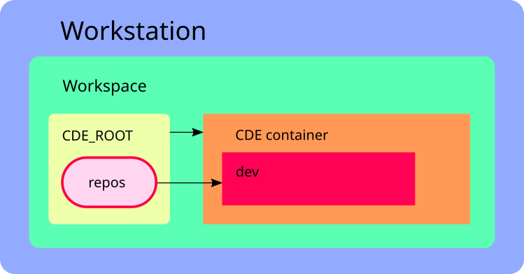
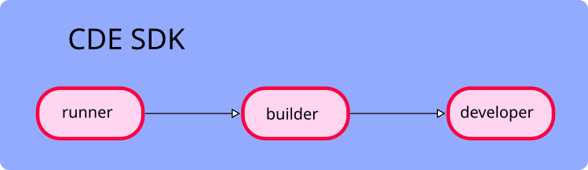

# Architecture

## Software architecture

The **CDE** project is based on **Docker**.
To understand the CDE architecture better you need to learn several concepts and terms that explain
how Docker works:

- *Docker container* - the running instance of a **Docker** image. There can be multiple instances
  of the same image.
- *Docker image* - the package produced by **Docker** build. It contains all executable files and
  environment, i.e. Ubuntu Latest and applications. **Docker** images can inherit from each other, thus
  they inherit all **Docker** image layers from the parent image.
- *Docker image layer* - **Docker** images are formed by layers, which basically are increments to
  the filesystem.
  Every filesystem change creates an additional layer in the **Docker** image.
  For instance, CentOS 7 is layer 1, installation of building tools is layer 2, and so on.

You can read more about **Docker** terminology in the
[official documentation](https://docs.docker.com/engine/docker-overview).

**CDE** is implemented to be run on any linux machine, that can run *docker* and *docker-compose*.

Developers may create multiple **CDE** root inside their own workspace. Only one instance of **CDE**
container for each **CDE** root directory is allowed.

**CDE** root is mounted inside **CDE** container which is based on Docker-in-Docker. This allows to
separate user's workspaces allowing to have separate caches, network segments and docker management,
etc.
Inside each **CDE** container there's another docker container called `dev` with development
environment. The directory `repos` from **CDE** source tree is mounted inside `dev` container
where it should be built.

## SDK

Essentially, the is the hierarchy of specialized **Docker** images that can be grouped into 3
subsets:

There are environments in **CDE SDK** that will enable you to develop, build, run and test your
project. **CDE SDK** environments should contain no product specific code, and contain only
tools to perform various kind of operations.

**CDE SDK** consists of three images:

- *runner* - Running environment is inherited from Ubuntu latest image, provided as official image by
  **Docker** hub.
- *builder* - Building environment is inherited from *runner* and contains tools for building, 
  i.e. `gcc`, `ld`, `make`, `patch`, etc.
- *developer* - Development environment is inherited from builder and includes tool and utilities,
  i.e. `strace`, `htop`, `gdb`, `dalgrind` etc.

In this environment developers can build, run, and debug the project code. It contains a
set of tools sufficient for software development, i.e. `vim`, `gdb`, `strace`, etc. **CDE SDK** is
stored as version controlled **Docker** images in **CDE registry**. Typically, developers don’t
need to change **CDE SDK**. During the local build process, SDK images will be automatically
downloaded from registry.

If **CDE SDK** needs to be updated (compiler update, extra tools, new run-time, etc.), **SDK**
should be rebuilt locally and uploaded back to the registry. Also, individual developers can update
and re-build **SDK** locally.

### Structure

**CDE SDK** is built from following files:

- `sdk/sdk.yml` - rules to build docker images, with names and dependencies.
- Docker files for building the corresponding images are located in `sdk` directory:
  - *runner* - `sdk/Dockerfile.runner`, etc.
  - *builder* - `sdk/Dockerfile.builder`, etc.
  - *developer* - `sdk/Dockerfile.developer`, etc.

## Development environment

Mainly developers will work in this environment which is intended for the development of the project
and has all accompanying tools. It allows building, running and instrumenting the software and
spawned into `dev` docker container, which will be running in it's own private network.
